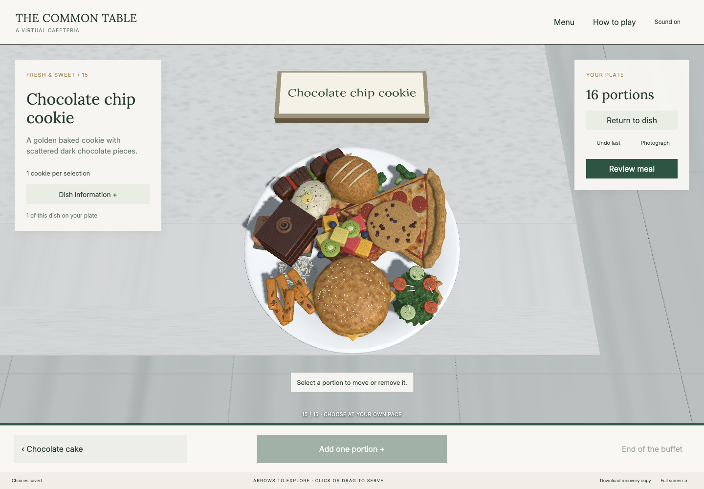

# Godot verification

Tested September 24, 2026 on macOS with Godot 4.7.2, its Compatibility web
renderer, and isolated browser profiles. Test identities and databases are
synthetic. Generated builds and databases are excluded from source control.

## Passed checks

- Official editor and export template SHA-512 verification; web import/export.
- All 15 food GLBs match the Babylon copies byte for byte; see
  [asset hashes](evidence/food-assets.json).
- Fourteen Python research-server tests.
- Survey integration checks: origin/window validation, participant identity,
  unique portion records, counts by plate, elapsed time, image count and ACK.
- Chromium: all foods, tray click and drag, cancel outside the plate, exact
  individual selection, movement, removal, recovery after refresh, menu/details,
  photograph download, completed research data, restricted conditions, mobile
  portrait/landscape, offline image recovery and iframe survey acknowledgement.
- Static website under a repository subpath: actual Godot WASM/PCK loaded, all
  models present, no Babylon global, browser storage, photographs, downloads,
  completion recovery, replay and touch controls. No API calls or failed requests.
- WebKit and Firefox: serving, navigation, plate view, 1024 × 1024 photograph,
  completion, acknowledged saving and recovery of the completed meal.
- A clean copy of the committed source imports and exports successfully without
  pre-existing Godot caches or generated textures. GitHub's Linux build also
  installs the pinned editor, passes the server tests and creates the web export.

See [game report](evidence/game-report.json),
[server tests](evidence/server-tests.txt), and
[survey bridge tests](evidence/qualtrics-bridge-tests.txt).
Additional reports: [WebKit/Firefox](evidence/cross-browser-report.json) and
[static site](evidence/pages-report.json).

## Visual inspection

The cafeteria, dish labels, full plate and mobile layout were inspected from
rendered browser screenshots. Lighting preserves the plate rim and counter
surface without clipping them to white. Food picking uses centimetre coordinates
internally to avoid Godot's fixed ray-test tolerance skipping tiny model triangles;
the displayed models and saved portion positions remain in metres.

## Remaining deployment checks

Maximum-capacity and touch checks are being completed after correcting a viewport
scaling issue. The public GitHub Pages URL is not yet deployed. External Qualtrics/Prolific studies and
central participant hosting are not part of this static preview verification.

Browser viewport emulation checks touch behavior and responsive layout. It does
not establish performance or compatibility on every physical phone or tablet.
